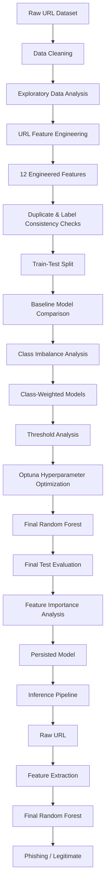
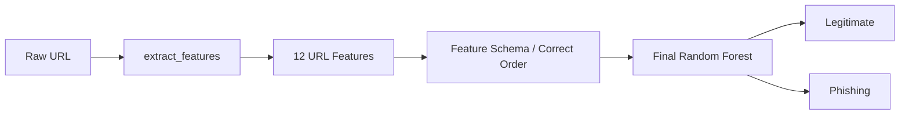

# Phishing URL Detection using Machine Learning

A machine learning-based phishing URL detection system that analyzes the structural and lexical characteristics of URLs and classifies them as **legitimate** or **phishing**.

The project uses custom URL feature engineering, exploratory data analysis, class-imbalance handling, model comparison, Optuna-based hyperparameter optimization, and a final class-balanced Random Forest classifier.

---

## 📌 Overview

Phishing URLs are designed to deceive users into visiting malicious websites by imitating legitimate domains, using suspicious keywords, unusual URL structures, excessive numerical characters, complex paths, and other obfuscation techniques.

This project attempts to identify such patterns directly from the URL without requiring the webpage to be opened.

The system:

1. Analyzes a large labeled URL dataset.
2. Performs exploratory analysis on URL characteristics.
3. Engineers **12 URL-based features**.
4. Handles class imbalance using class weighting.
5. Compares multiple machine learning models.
6. Performs threshold analysis to study the precision-recall tradeoff.
7. Uses **Optuna** for hyperparameter optimization.
8. Selects a class-balanced **Random Forest** as the final model.
9. Provides a standalone inference pipeline that accepts a raw URL and predicts whether it is legitimate or phishing.

---

# 🚀 Project Pipeline



---

# 🧠 Dataset

The project uses a labeled phishing URL dataset containing approximately **507K URLs** after preprocessing.

The target variable is:

| Label | Meaning |
|------:|---------|
| `0` | Legitimate |
| `1` | Phishing |

### Class Distribution

| Class | Samples |
|---|---:|
| Legitimate | 392,896 |
| Phishing | 114,298 |
| **Total** | **507,194** |

The dataset is therefore imbalanced, with phishing URLs forming the minority class.

Because simply optimizing accuracy can hide poor minority-class performance, the project evaluates:

- Accuracy
- Precision
- Recall
- F1-score
- Confusion Matrix

The primary optimization metric during hyperparameter tuning was **F1-score**.

---

# 🔍 Exploratory Data Analysis

Several URL characteristics were analyzed before model training.

## Special Character Analysis

Non-alphanumeric characters occurring in phishing URLs were analyzed using:

- Frequency in phishing URLs
- Probability of a URL being phishing given the presence of the character
- A custom ranking score combining probability and logarithmic frequency

The analysis was used to select candidate dangerous characters for feature engineering.

The ranking score was a project-specific heuristic rather than a standard statistical feature-selection metric.

## TLD Analysis

Top-level domains were similarly analyzed based on their association with phishing URLs.

The resulting list was used to construct the `Dangerous TLD` feature.

> The term "dangerous TLD" refers to TLDs that showed stronger association with phishing URLs in this dataset; it does not mean that the TLD itself is inherently malicious.

---

# ⚙️ Feature Engineering

The final model uses **12 URL-based features**.

| # | Feature | Description |
|---|---|---|
| 1 | URL length | Total number of characters in the URL |
| 2 | Number of dots | Number of `.` characters |
| 3 | Number of slashes | Number of `/` characters |
| 4 | Percentage of numerical characters | Ratio of digits to total URL length |
| 5 | Dangerous characters | Presence of selected suspicious special characters |
| 6 | Dangerous TLD | Whether the extracted TLD belongs to the selected dataset-derived list |
| 7 | Entropy | Character-distribution based entropy feature |
| 8 | IP Address | Whether an IPv4-like address is present in the URL |
| 9 | Domain name length | Length of the extracted domain |
| 10 | Suspicious keywords | Presence of predefined phishing-related keywords |
| 11 | Repetitions | Presence of repeated characters in the extracted domain |
| 12 | Redirections | Presence of an additional `//` after the initial protocol portion |

### Feature Extraction Techniques

The project uses:

- Regular expressions
- `tldextract`
- URL parsing
- Character frequency analysis
- String-based analysis

Example suspicious keywords include:

```text
secure
account
update
login
verify
signin
bank
notify
click
inconvenient
```

---

# 🧹 Data Cleaning and Leakage Checks

Several preprocessing checks were performed before modeling.

### Duplicate URLs

Duplicate URLs were checked to identify repeated samples.

### Conflicting Labels

URLs appearing with both legitimate and phishing labels were identified.

Only one conflicting URL was found during analysis and was treated as a data-quality issue.

### Accidental Index Column

During persistence of the feature dataset, an `Unnamed: 0` index column was discovered.

It was removed before final model training because it represented the original DataFrame index rather than a meaningful URL feature.

This was important because an index column can introduce unintended information into a machine learning model.

---

# 📊 Correlation Analysis

Correlation analysis was used during exploratory analysis to understand relationships between the engineered features and the target.

One notable relationship was the high correlation between:

- URL length
- Entropy

PCA was investigated as a possible dimensionality-reduction technique, but the final Random Forest model was trained using the original features rather than relying on PCA.

This preserved feature interpretability and avoided unnecessary dimensionality reduction for a tree-based model.

---

# 🤖 Model Comparison

Several models were evaluated during experimentation:

- Decision Tree
- Random Forest
- AdaBoost
- XGBoost

The evaluation focused on multiple metrics rather than accuracy alone.

Initial experiments showed that different models produced different precision-recall tradeoffs.

For phishing detection, recall is particularly important because a false negative means that a phishing URL is classified as legitimate.

---

# ⚖️ Handling Class Imbalance

The dataset contains significantly more legitimate URLs than phishing URLs.

Instead of immediately applying oversampling or undersampling, class weighting was investigated first.

### Random Forest

```python
class_weight="balanced"
```

This automatically gives greater importance to the minority phishing class during training.

### XGBoost

For XGBoost, class imbalance was handled using:

```python
scale_pos_weight = number_of_legitimate / number_of_phishing
```

The calculated value was approximately:

```text
3.4375
```

This encourages the model to pay greater attention to the phishing class.

---

# 🎚️ Threshold Analysis

Classification models produce scores/probabilities that are converted into class predictions using a threshold.

The default threshold is generally:

```text
0.5
```

The project experimented with different thresholds to understand the tradeoff between:

- Precision
- Recall
- False positives
- False negatives

Lowering the threshold generally increases the number of URLs classified as phishing, increasing phishing recall while also increasing false positives.

Threshold tuning was treated as an analysis of the model's operating point rather than as a replacement for model optimization.

The final reported test metrics were obtained using the model's standard prediction threshold.

---

# 🔬 Hyperparameter Optimization

After baseline and class-balanced model comparisons, **Optuna** was used for hyperparameter optimization.

Optuna's TPE-based search was used to explore promising regions of the hyperparameter space.

The optimization objective was:

```text
F1-score
```

A 3-fold `StratifiedKFold` cross-validation strategy was used to preserve the class distribution across folds.

---

# 🌲 Final Model

The final model is a **class-balanced Random Forest Classifier**.

The best hyperparameters found through Optuna were:

| Hyperparameter | Value |
|---|---:|
| `n_estimators` | 344 |
| `max_depth` | 24 |
| `min_samples_split` | 5 |
| `min_samples_leaf` | 1 |
| `max_features` | `log2` |
| `class_weight` | `balanced` |
| `random_state` | 22 |

The final model was retrained on the complete training portion using these parameters.

---

# 📈 Final Test Results

The final Random Forest was evaluated on the held-out test set.

| Metric | Score |
|---|---:|
| **Accuracy** | **89.46%** |
| **Precision** | **75.15%** |
| **Recall** | **78.62%** |
| **F1-score** | **76.84%** |

### Confusion Matrix

```text
                  Predicted
               Legitimate  Phishing

Actual Legitimate    73003    5868
Actual Phishing       4826   17742
```

Therefore:

```text
True Negatives  = 73,003
False Positives =  5,868
False Negatives =  4,826
True Positives  = 17,742
```

Since phishing is encoded as class `1`, the reported precision, recall and F1-score refer to the **phishing class**.

---

# 📌 Feature Importance

Feature importance from the final Random Forest was analyzed to understand which engineered features contributed most to the model's decisions.

The most influential features were approximately:

1. Percentage of numerical characters
2. Entropy
3. Domain name length
4. URL length
5. Number of dots
6. Number of slashes
7. Suspicious keywords
8. Dangerous characters
9. Dangerous TLD
10. IP Address
11. Redirections
12. Repetitions

The importance values are **model-specific** and should not be interpreted as causal relationships.

A high feature importance means that the trained Random Forest relied substantially on that feature when making predictions; it does not prove that the feature itself causes a URL to be phishing.

---

# 🔄 Inference Pipeline

The trained model does not directly accept a raw URL.

A raw URL first passes through the same feature extraction process used during training.



## Feature Order

The inference pipeline explicitly maintains the same feature order used during training:

```python
FEATURE_COLUMNS = [
    "URL length",
    "Number of dots",
    "Number of slashes",
    "Percentage of numerical characters",
    "Dangerous characters",
    "Dangerous TLD",
    "Entropy",
    "IP Address",
    "Domain name length",
    "Suspicious keywords",
    "Repetitions",
    "Redirections"
]
```

This prevents feature-order mismatches during prediction.

---

# 💾 Model Persistence

The final trained model can be persisted using `joblib`.

The persisted artifact contains:

- Trained Random Forest
- Feature column schema

The inference script loads the persisted model and applies the same feature extraction process before making predictions.

---

# 🗂️ Project Structure

```text
Phishing-URL-Detection/
│
├── train_model_persist.py
│       ├── Loads data
│       ├── Prepares features
│       ├── Trains final Random Forest
│       ├── Evaluates model
│       └── Saves model artifact
│
├── inference_model.py
│       ├── Loads persisted model
│       ├── Extracts features from raw URL
│       ├── Maintains feature order
│       └── Predicts phishing / legitimate
│
├── x.csv
├── y.csv
├── requirements.txt
├── README.md
│
└── phishing_model.pkl
        └── Local model artifact
        └── Not tracked by Git
```

---

# 🛠️ Technologies Used

### Programming Language

- Python

### Machine Learning

- Scikit-learn
- XGBoost
- Optuna

### Data Processing

- Pandas
- NumPy

### Feature Engineering

- Regular Expressions (`re`)
- `tldextract`
- SciPy

### Visualization

- Matplotlib
- Seaborn

### Model Persistence

- Joblib

---

# ⚙️ Installation

Clone the repository:

```bash
git clone <your-repository-url>
cd Phishing-URL-Detection
```

Create a virtual environment:

```bash
python -m venv venv
```

Activate it on Windows:

```bash
venv\Scripts\activate
```

Install dependencies:

```bash
pip install -r requirements.txt
```

---

# 📦 Requirements

Example `requirements.txt`:

```text
pandas
numpy
scikit-learn
scipy
matplotlib
seaborn
xgboost
optuna
tldextract
joblib
```

---

# ▶️ Training

To train and persist the final model:

```bash
python train_model_persist.py
```

The script:

1. Loads the processed feature dataset.
2. Removes the accidental index column if present.
3. Performs a stratified train-test split.
4. Initializes the final class-balanced Random Forest.
5. Trains the model.
6. Evaluates it on the held-out test set.
7. Saves the trained model artifact.

The saved model is:

```text
phishing_model.pkl
```

---

# 🔎 Inference

To classify a URL:

```bash
python inference_model.py
```

The program accepts a URL and extracts the same 12 features used during training.

Example:

```text
Enter URL: https://example.com/login
```

The system then produces a prediction and phishing probability.

The exact output depends on the trained model and extracted features.

---
# ⚠️ Limitations

### 1. URL-only analysis

The model analyzes URL characteristics and does not inspect:

- Webpage HTML
- Page content
- JavaScript behavior
- SSL certificate information
- DNS information
- Domain registration information
- Website reputation

Therefore, classification is based only on URL-level characteristics.

### 2. Dataset dependence

Some features, particularly:

- Dangerous characters
- Dangerous TLDs
- Suspicious keywords

are based on patterns identified from the training dataset.

Their usefulness may change when the model encounters URLs from different distributions.

### 3. False positives and false negatives

The final model still produces both:

- False positives: legitimate URLs classified as phishing
- False negatives: phishing URLs classified as legitimate

This is reflected in the final confusion matrix.
---
# 🎯 Project Highlights

- Analyzed and engineered features from **507K+ labeled URLs**
- Designed **12 URL-based features** covering URL structure, character composition, domain properties and suspicious patterns
- Compared multiple machine learning classifiers
- Addressed class imbalance using class-weighted learning
- Used **Optuna** for hyperparameter optimization
- Final Random Forest achieved:
  - **89.46% Accuracy**
  - **75.15% Precision**
  - **78.62% Phishing Recall**
  - **76.84% F1-score**
- Built a standalone inference pipeline that converts a raw URL into the same feature representation used during model training
- Analyzed model feature importance to understand the contribution of engineered URL characteristics

---

# 👨‍💻 Author

**Satyam Gupta**

B.Tech in Electronics & Communication Engineering<\br>
Maulana Azad National Institute of Technology, Bhopal


